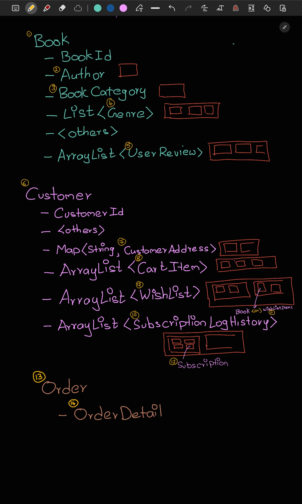

# 📚 Bookify
> A simple online book store application.

# 🧑‍🏭 Work: model package:
**package com.bookify.model**
> Thease are all the classes 
  1.  Author.java
  2.  Genre.java
  3.  BookCategory.java
  4.  Book.java     [M]
  5.  Wishlist.java
  6.  Subscription.java
  7.  SubscriptionLogHistory.java
  8.  UserReview.java
  9.  CustomerAddress.java
  10. Customer.java [M]
  11. OrderDetail.java
  12. Orders.java   [M]

### 🏛️ Model Classes
- tbl_book-> Book.java
  - BookCategory.java
  - Genre.java
  - Author.java
- tbl_customer -> Customer.java
  - CustomerAddress.java
  - ShoppingCart -> CartItem.java
  - Wishlist.java List<Books>
  - SubscriptionLogHistory.java
    - Subscription.java
- tbl_order-> Orders.java
  - OrderDetail.java

